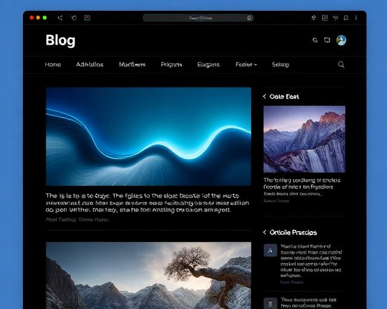

# 🚀 Vaibhav's Portfolio

Modern, responsive developer portfolio built with React, Vite, TypeScript, Tailwind CSS (shadcn/ui + Radix primitives), and a clean deployment pipeline via GitHub Pages.

---

## 🖥️ Live Demo
[View Portfolio](https://vaibhav88614.github.io)

---

## 📦 Tech Stack
- React (TypeScript)
- Vite
- Tailwind CSS + tailwind-merge + tailwindcss-animate + @tailwindcss/typography
- shadcn/ui + Radix UI primitives
- React Router, TanStack Query, React Hook Form, Zod
- PostCSS + Autoprefixer
- ESLint + TypeScript

---

## 🧩 Features
- Responsive, accessible UI
- Structured sections (About, Skills, Projects, Experience, Education, Contact)
- Design tokens + dark / light (auto) theming via CSS custom properties
- Single Tailwind entry with modular style layers
- Asset copy script for stable `/images/*` paths
- Safe git sync & deploy helper scripts

---

## 📁 Structure
```
src/
	assets/              # Source images (originals)
	styles/
		index.css          # Tailwind directives + imports
		design-tokens.css  # Theme variables (dark default + auto light)
		base.css           # Global resets/base overrides
		animations.css     # Animation utilities
		typography.css     # Prose styling overrides
	components/          # UI + shadcn components
		ui/                # Primitive components
	hooks/               # Custom hooks
	lib/                 # Utilities
	pages/               # Page-level components
	main.tsx             # App entry
public/
	images/              # Copied images (runtime served)
docs/                  # Build output (GitHub Pages)
```

### Style Layering
- Only `index.css` contains `@tailwind` directives.
- Tokens first, then base/animations/typography imports.
- All colors HSL via CSS custom properties.

### Theming
- Default: dark token set.
- Light mode: activated automatically with `prefers-color-scheme: light` when `.dark` class not present.
- Forced dark: add `.dark` class on `<html>` or a wrapper (e.g. using next-themes / manual toggle).

---

## 🛠️ Development
```powershell
git clone https://github.com/vaibhav88614/vaibhav88614.github.io.git
cd vaibhav88614.github.io
npm install
npm run dev
```
Production build:
```powershell
npm run build
```

Formatting (Prettier):
```powershell
npm run format
```

Lint:
```powershell
npm run lint
```

---

## 🚀 Deployment (GitHub Pages /docs)
Configured to output to `docs/`. Pages settings: Branch `main`, Folder `/docs`.
```powershell
npm run build
./deploy.ps1
```
Force:
```powershell
./deploy.ps1 -Force
```
Custom domain: add `docs/CNAME`.

---

## 🧰 Utility Scripts
| Script | Purpose |
|--------|---------|
| `organize-assets.ps1` | Copy images to `public/images` |
| `safe-sync.ps1` | Stash + rebase + restore changes |
| `cleanup-build-artifacts.ps1` | Move stray hashed root build files |
| `move-legacy-build.ps1` | Archive legacy `assets/` bundle |
| `deploy.ps1` | Commit changed `docs/` output |
| `analyze` (npm) | Build with bundle visualizer (outputs `stats/bundle-analysis.html`) |

NPM aliases:
```
assets        -> organize-assets.ps1
assets:force  -> organize-assets.ps1 -Force
sync          -> safe-sync.ps1
deploy:ps     -> deploy.ps1
legacy:move   -> move-legacy-build.ps1
legacy:clean  -> cleanup-build-artifacts.ps1
format        -> prettier --write .
analyze       -> build with bundle treemap (see stats/)
```

---

## 📊 Bundle Analysis

Generate a treemap to inspect bundle size contributions:

```powershell
npm run analyze
```
Outputs HTML report at `stats/bundle-analysis.html` (not auto-opened). You can open it in your browser to investigate large dependencies.

---

## ✅ Pre-Commit Automation

The repo uses a lightweight Git hook (Husky) that, on each commit:
1. Normalizes the lockfile to ensure only public registry tarball URLs are kept.
2. Auto-stages the lockfile if it changed.
3. Runs ESLint and TypeScript type checking.

If you ever need to bypass hooks (not recommended):
```powershell
git commit -m "msg" --no-verify
```
Keep normal usage so consistency & cleanliness are preserved.

---

## 🌓 Theme Toggle

The theme toggle stores the user's choice in `localStorage` under `theme-preference` and applies it early via an inline script in `index.html` to prevent a flash of incorrect theme (FOUC). Logic:

1. If a stored value exists (`dark` or `light`) it wins.
2. Otherwise system preference (`prefers-color-scheme`) decides.
3. Toggle button adds/removes the `dark` class on `<html>` and updates storage.

If you change the storage key, also update the inline script in `index.html` and `ThemeToggle.tsx`.

---

## ✉️ Contact Form (Formspree)

The contact form posts to a Formspree endpoint if configured. To enable:

1. Create a form at https://formspree.io/ (Dashboard → New Form).
2. Copy the endpoint URL (looks like `https://formspree.io/f/<id>`).
3. Create a `.env.local` file (ignored by git) based on `.env.example`:
	```env
	VITE_FORMSPREE_ENDPOINT=https://formspree.io/f/yourid
	```
4. Restart the dev server so Vite picks up the new env var.
5. Submit the form; you should see success UI and an email / dashboard entry in Formspree.

If `VITE_FORMSPREE_ENDPOINT` is empty the UI shows a configuration error when submitting.

Production: Add the same variable in your GitHub Pages build environment (if using a workflow) or bake it at build time before deploying.

---

## ✨ Typography
The `@tailwindcss/typography` plugin is enabled; customize via `typography.css` and apply with the `prose` class.

---

## 🌓 Theming Model
Tokens: `design-tokens.css` defines base + `.dark` + auto light media query.
You can add a theme switcher by toggling `.dark` on the root element and persisting user preference (e.g. localStorage or `next-themes`).

---

## 🛠️ Editor Setup
- VS Code settings included to silence unknown Tailwind at-rule warnings.
- Stylelint config ignores Tailwind-specific at-rules without extra plugin overhead.
- Only import `styles/index.css` once to avoid duplicate layers.

---

## 🌟 Screenshots



---

## 🤝 Connect
- [GitHub](https://github.com/vaibhav88614)
- [LinkedIn](#)
- [Email](mailto:your.email@example.com)

---

## 📄 License
MIT © 2025 Vaibhav

---

> Designed & developed by Vaibhav


## How can I edit this code?

There are several ways of editing your application.


**Use your preferred IDE**


The only requirement is having Node.js & npm installed - [install with nvm](https://github.com/nvm-sh/nvm#installing-and-updating)

Follow these steps:

```sh
# Step 1: Clone the repository using the project's Git URL.
git clone <YOUR_GIT_URL>

# Step 2: Navigate to the project directory.
# Welcome to your project

## Project info


## How can I edit this code?

There are several ways of editing your application.


**Use your preferred IDE**


The only requirement is having Node.js & npm installed - [install with nvm](https://github.com/nvm-sh/nvm#installing-and-updating)

Follow these steps:

```sh
# Step 1: Clone the repository using the project's Git URL.
git clone <YOUR_GIT_URL>

# Step 2: Navigate to the project directory.
cd <YOUR_PROJECT_NAME>

# Step 3: Install the necessary dependencies.
npm run dev
```


**Use GitHub Codespaces**

- Navigate to the main page of your repository.
- Click on the "Code" button (green button) near the top right.

This project is built with:

- Vite
- TypeScript
- React
[](https://vaibhav88614.github.io)

# 🚀 Vaibhav's Portfolio

Welcome to my personal portfolio website! This project showcases my skills, experience, and projects as a developer. Built with modern web technologies, it features a clean, responsive, and visually appealing design.

---

## 🖥️ Live Demo

[View Portfolio](https://vaibhav88614.github.io)

---

## 📦 Tech Stack

- **React** (TypeScript)
- **Vite** (Fast build tool)
- **Tailwind CSS** (Utility-first CSS framework)
- **ESLint** (Linting)
- **PostCSS** (CSS transformations)

---

## 🧩 Features

- Responsive design for all devices
- Interactive sections: About, Skills, Projects, Experience, Education, Contact
- Modern UI components (Accordion, Cards, Carousel, Dialogs, Toasts, etc.)
- Smooth navigation and transitions
- Custom hooks for mobile and toast notifications
- Optimized images and assets

---

## 📁 Project Structure (Updated)

```
src/
	assets/             # Source images (originals)
	styles/             # Centralized style layers
		base.css          # Tailwind layers + global base
		design-tokens.css # CSS custom properties / theme tokens
		animations.css    # Animation utilities & keyframes
	components/         # Reusable UI components
		ui/               # UI primitives (accordion, button, etc.)
	hooks/              # Custom React hooks
	lib/                # Utility functions
	pages/              # Main pages (Index, NotFound)
	main.tsx            # App entry (imports consolidated styles)
public/
	images/             # Deployed static images (copied via organize-assets.ps1)
docs/                 # Vite build output (served by GitHub Pages)
```

### Asset Workflow
- Keep canonical images in `src/assets/`.
- Run `./organize-assets.ps1` to copy them into `public/images/` for stable public paths `/images/...`.
- Build places processed/hased files inside `docs/` automatically.

### Style Workflow
- Do not add Tailwind directives in scattered files—keep them in `styles/base.css`.
- Add/modify design tokens in `styles/design-tokens.css`.
- Add new animations to `styles/animations.css`.

---

## 🛠️ Setup & Development

1. **Clone the repo**
	```sh
	git clone https://github.com/vaibhav88614/vaibhav88614.github.io.git
	cd vaibhav88614.github.io
	```
2. **Install dependencies**
	```sh
	npm install
	```
3. **Start development server**
	```sh
	npm run dev
	```
4. **Build for production**
	```sh
	npm run build
	```

---

## � Deployment (GitHub Pages via docs/)

This repository is configured so Vite outputs directly into the `docs/` folder (see `vite.config.ts`). GitHub Pages should be set to:

Branch: `main`  |  Folder: `/docs`

### Deploy steps

```sh
# Build & deploy
npm run build
./deploy.ps1
```

The script will:
- Ensure the working tree is clean (unless you pass `-Force`)
- Confirm `docs/` exists and add `.nojekyll`
- Commit only if build output changed

### One-liner (force deploy)
```powershell
./deploy.ps1 -Force
```

### Custom domain (optional)
Add a `CNAME` file inside `docs/` containing your domain name.

---

## 🧹 Cleaning Legacy Build Artifacts

If you previously copied hashed build files (e.g. `index-XYZ.js`) into the repo root, you can move them out non-destructively:

```powershell
./cleanup-build-artifacts.ps1
```

Moved files live in `_old-root-build/`. Inspect and delete when you're satisfied.

---

## 🗂️ Organizing Assets

To copy all current raw images into `public/images/` (non-destructive):

```powershell
./organize-assets.ps1
```

Add `-Force` to overwrite duplicates if filenames collide:

```powershell
./organize-assets.ps1 -Force
```

Then reference them in code or meta tags as `/images/<name>`.

---

---

## �📚 Portfolio Sections

- **Hero**: Introduction and profile
- **About**: Background and story
- **Skills**: Technologies and tools
- **Projects**: Featured work with images
- **Experience**: Professional journey
- **Education**: Academic history
- **Contact**: Get in touch
- **Footer**: Social links & copyright

---

## 🌟 Screenshots


---

## 🤝 Connect

- [LinkedIn](#)
- [GitHub](https://github.com/vaibhav88614)
- [Email](mailto:your.email@example.com)

---

## �️ Editor Tailwind Setup

If your editor flags `@tailwind`, `@apply`, or `@layer` as unknown:
- VS Code: ensure Tailwind CSS IntelliSense extension is installed
- We ship `.vscode/settings.json` that sets `css.lint.unknownAtRules` to `ignore`
- `.stylelintrc.json` ignores Tailwind-specific at-rules
- Only import `src/styles/index.css` once (it contains directives + imports)
- Keep custom CSS variables in `design-tokens.css`; avoid spreading `@tailwind` directives across files

Re-run the dev server after changing Tailwind config so class generation updates.

---

## �📄 License

This project is open source and available under the [MIT License](LICENSE).

---

> Designed & developed by Vaibhav
Tailwind CSS


