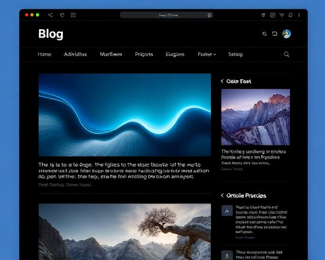

# Welcome to your project

## Project info


## How can I edit this code?

There are several ways of editing your application.


**Use your preferred IDE**


The only requirement is having Node.js & npm installed - [install with nvm](https://github.com/nvm-sh/nvm#installing-and-updating)

Follow these steps:

```sh
# Step 1: Clone the repository using the project's Git URL.
git clone <YOUR_GIT_URL>

# Step 2: Navigate to the project directory.
cd <YOUR_PROJECT_NAME>

# Step 3: Install the necessary dependencies.
npm run dev
```


**Use GitHub Codespaces**

- Navigate to the main page of your repository.
- Click on the "Code" button (green button) near the top right.

This project is built with:

- Vite
- TypeScript
- React
[](https://vaibhav88614.github.io)

# 🚀 Vaibhav's Portfolio

Welcome to my personal portfolio website! This project showcases my skills, experience, and projects as a developer. Built with modern web technologies, it features a clean, responsive, and visually appealing design.

---

## 🖥️ Live Demo

[View Portfolio](https://vaibhav88614.github.io)

---

## 📦 Tech Stack

- **React** (TypeScript)
- **Vite** (Fast build tool)
- **Tailwind CSS** (Utility-first CSS framework)
- **ESLint** (Linting)
- **PostCSS** (CSS transformations)

---

## 🧩 Features

- Responsive design for all devices
- Interactive sections: About, Skills, Projects, Experience, Education, Contact
- Modern UI components (Accordion, Cards, Carousel, Dialogs, Toasts, etc.)
- Smooth navigation and transitions
- Custom hooks for mobile and toast notifications
- Optimized images and assets

---

## 📁 Project Structure

```
src/
  assets/         # Images and media
  components/     # Reusable UI components
	 ui/           # UI primitives (accordion, button, etc.)
  hooks/          # Custom React hooks
  lib/            # Utility functions
  pages/          # Main pages (Index, NotFound)
public/           # Static files
```

---

## 🛠️ Setup & Development

1. **Clone the repo**
	```sh
	git clone https://github.com/vaibhav88614/vaibhav88614.github.io.git
	cd vaibhav88614.github.io
	```
2. **Install dependencies**
	```sh
	npm install
	```
3. **Start development server**
	```sh
	npm run dev
	```
4. **Build for production**
	```sh
	npm run build
	```

---

## � Deployment (GitHub Pages via docs/)

This repository is configured so Vite outputs directly into the `docs/` folder (see `vite.config.ts`). GitHub Pages should be set to:

Branch: `main`  |  Folder: `/docs`

### Deploy steps

```sh
# Build & deploy
npm run build
./deploy.ps1
```

The script will:
- Ensure the working tree is clean (unless you pass `-Force`)
- Confirm `docs/` exists and add `.nojekyll`
- Commit only if build output changed

### One-liner (force deploy)
```powershell
./deploy.ps1 -Force
```

### Custom domain (optional)
Add a `CNAME` file inside `docs/` containing your domain name.

---

## 🧹 Cleaning Legacy Build Artifacts

If you previously copied hashed build files (e.g. `index-XYZ.js`) into the repo root, you can move them out non-destructively:

```powershell
./cleanup-build-artifacts.ps1
```

Moved files live in `_old-root-build/`. Inspect and delete when you're satisfied.

---

---

## �📚 Portfolio Sections

- **Hero**: Introduction and profile
- **About**: Background and story
- **Skills**: Technologies and tools
- **Projects**: Featured work with images
- **Experience**: Professional journey
- **Education**: Academic history
- **Contact**: Get in touch
- **Footer**: Social links & copyright

---

## 🌟 Screenshots




---

## 🤝 Connect

- [LinkedIn](#)
- [GitHub](https://github.com/vaibhav88614)
- [Email](mailto:your.email@example.com)

---

## 📄 License

This project is open source and available under the [MIT License](LICENSE).

---

> Designed & developed by Vaibhav
- Tailwind CSS

## How can I deploy this project?


Yes, you can!

To connect a domain, navigate to Project > Settings > Domains and click Connect Domain.


